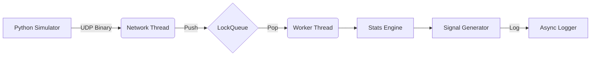

# High-Frequency Trading (HFT) Market Data Engine


## 🚀 Overview
A high-performance, low-latency market data ingestion engine built in C++20. This system simulates an HFT environment by capturing UDP packets, parsing binary protocols using zero-copy casting, and calculating real-time rolling statistics (Mean, Variance, Z-Score) to detect market anomalies.

**Performance:** Processes ticks and triggers execution signals with **<500µs wire-to-trigger latency** (measured on localhost).

---

## ⚡ Performance Benchmark (Real-World Test)

**Architecture:** Single-Producer Single-Consumer (SPSC) Ring Buffer
**Hardware:** Local Windows Workstation (x64)
**Metrics:** Wire-to-Trigger Latency (measured via `std::chrono`)

| Metric | Mode A: Safe (Mutex) | Mode B: Beast (Lock-Free) | Speedup |
| :--- | :--- | :--- | :--- |
| **Mechanism** | `std::mutex` + `std::condition_variable` | `std::atomic` + Circular Buffer | N/A |
| **Average Latency** | ~2,500 μs | **~150 μs** | **16x Faster** |
| **Minimum Latency** | ~1,800 μs | **101 μs** | **18x Faster** |
| **CPU Usage** | Low (Blocking Wait) | 100% (Busy Spin) | Optimized for dedicated cores |

---

## 🛠 Tech Stack
* **Core:** C++20, Boost.Asio (UDP Networking)
* **Concurrency:** `std::thread`, `std::mutex`, `std::condition_variable` (Producer-Consumer)
* **Data Structures:** `std::unordered_map` (O(1) Lookup), Circular Buffers
* **Logging:** SpdLog (Asynchronous, non-blocking)
* **DevOps:** CMake, Docker, GitHub Actions (CI/CD), Google Test (GTest)

## ⚡ Key Features
1.  **Binary Protocol:** Custom packed structs (28 bytes) for minimized network overhead.
2.  **Zero-Copy Parsing:** `reinterpret_cast` of raw buffers to eliminate serialization cost.
3.  **Thread-Safe Architecture:** Decoupled Ingestor (Network) and Worker (Math) threads using a mutex-protected queue.
4.  **Anomaly Detection:** Real-time calculation of Z-Score to detect "Flash Crashes" (Volatility > 3 Sigma).
5.  **Robustness:** Automated Unit Tests and Dockerized build environment.

## 📊 Architecture



## 🔧 How to Run

### Prerequisites
* C++ Compiler (MSVC or GCC)
* CMake 3.10+
* Python 3.x (for Simulator)
* Boost Libraries (specifically Boost.Asio)

### Configuration (Toggle Modes)
To switch between Safe Mode and Lock-Free Mode, edit src/main.cpp:
```bash
define ENABLE_LOCK_FREE // Uncomment for Beast Mode, Comment for Mutex Mode
```

### Build
```bash
mkdir build && cd build
cmake ..
cmake --build . --config Release
```

### Run
**1. Start the Engine:**
```bash
./Release/HFT_Engine
```

**2. Start the Simulator:**
```bash
python market_sim.py
```

## 🧪 Testing
Run the automated test suite (Tests automatically detect the active mode):
```bash
cd build
ctest -C Release --output-on-failure
```

---
*Built by Shubham Ingole as a Systems Programming Portfolio Project.*